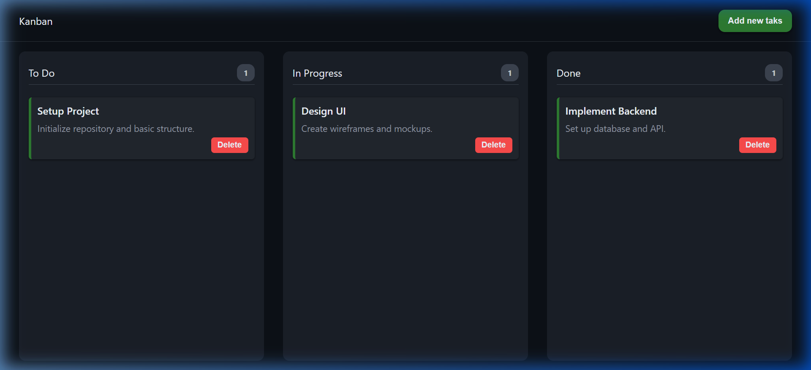

# 📋 Kanban Board — Productivity Unleashed


A sleek, minimal, and highly functional Kanban Board designed to help you organize your tasks with ease. Built with pure JavaScript, it features a fluid drag-and-drop interface and persistent local storage to keep your workflow synchronized.

---

## 🚀 Live Demo

Check out the live application here:  
**[👉 View Live Project](https://harsha5200-d.github.io/kannban1/)**

---

## 📸 Preview



---

## ✨ Features

- **🖱️ Drag & Drop Interface**: Effortlessly move tasks between 'To Do', 'In Progress', and 'Done' columns.
- **💾 Local Persistence**: Your tasks are automatically saved to your browser's local storage, so you never lose your progress.
- **➕ Easy Task Creation**: Quick modal-based task entry with titles and detailed descriptions.
- **🗑️ Task Management**: Delete completed or irrelevant tasks with a single click.
- **📊 Real-time Counting**: Automatic task counters for each column to track your workload.
- **📱 Responsive Design**: Optimized for a seamless experience across different screen sizes.

---

## 🛠️ Technology Stack

- **HTML5**: Semantic structure for better accessibility and SEO.
- **CSS3**: Modern layout using Flexbox and Grid, with glassmorphism design elements.
- **JavaScript (ES6+)**: Vanilla JS for high-performance DOM manipulation and drag-and-drop logic.

---

## 📦 Getting Started

1. **Clone the repository:**
   ```bash
   git clone https://github.com/harsha5200-d/kannban1.git
   ```
2. **Navigate to the project folder:**
   ```bash
   cd kannban1
   ```
3. **Open `index.html` in your browser.**

---

## 🤝 Contributing

Suggestions and improvements are always welcome! Feel free to:
1. Fork the repo.
2. Create your feature branch (`git checkout -b feature/NewFeature`).
3. Commit your changes (`git commit -m 'Add NewFeature'`).
4. Push to the branch (`git push origin feature/NewFeature`).
5. Open a Pull Request.

---

## 📄 License

Distributed under the MIT License. See `LICENSE` for more information.

---

<p align="center">
  Built with ❤️ by <a href="https://github.com/harsha5200-d">Harsha</a>
</p>
